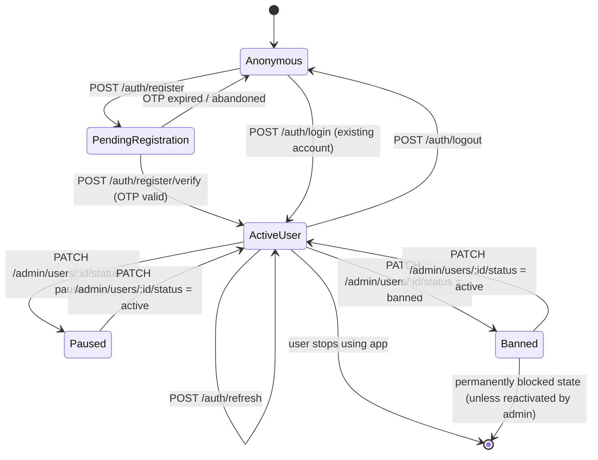
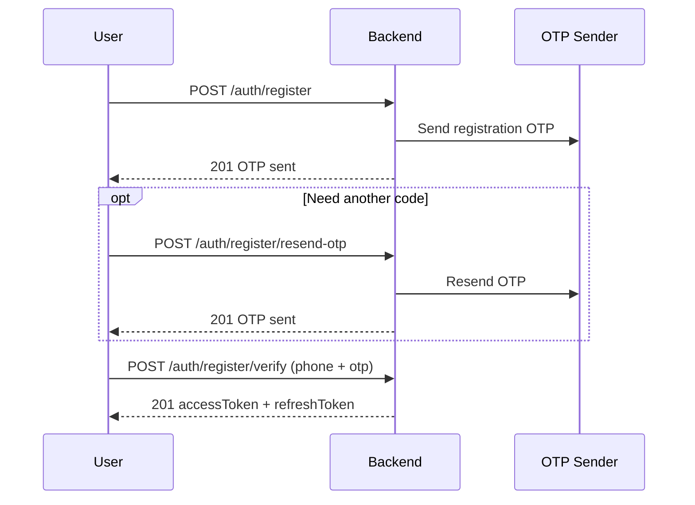
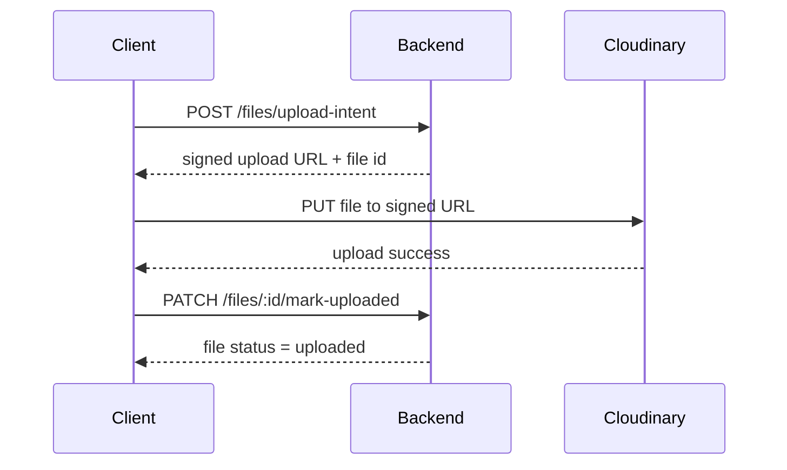

# Market Place — User Flows

> This document describes the complete user lifecycle in the system, from first visit to moderation outcomes, for all user types.
>
> For payload schemas and field-level validation, see `docs/integration-guide.md`.

---

## Table of Contents

1. [User Types in the System](#1-user-types-in-the-system)
2. [Complete Lifecycle (Start → End)](#2-complete-lifecycle-start--end)
3. [Anonymous Visitor Flows](#3-anonymous-visitor-flows)
4. [Authentication Flows](#4-authentication-flows)
5. [Regular User Flows](#5-regular-user-flows)
6. [Admin Flows](#6-admin-flows)
7. [State Transitions & End States](#7-state-transitions--end-states)
8. [Rate Limits by Journey Stage](#8-rate-limits-by-journey-stage)
9. [Common Error Paths](#9-common-error-paths)
10. [Endpoint Coverage Checklist](#10-endpoint-coverage-checklist)

---

## 1. User Types in the System

The backend supports these effective user personas:

1. **Anonymous Visitor (Unauthenticated)**
   - Can browse public content only.
   - Cannot create/update/delete resources.

2. **Regular User (Authenticated)**
   - Single account type that can do both **buyer** and **seller** activities.
   - Can manage profile, create products, chat, rate, and report.

3. **Admin (Authenticated + Privileged)**
   - A user with admin privileges (`is_admin = true`).
   - Can moderate users and reports.

Admin bootstrap is environment-seeded via `ADMIN_PHONE` + `ADMIN_PASSWORD` using `npm run seed:admin`, then managed in-app.

> There is no separate buyer role or seller role in the data model; those are activities of the same regular user type.

---

## 2. Complete Lifecycle (Start → End)

### Lifecycle Narrative

1. User enters as **Anonymous**.
2. User either logs in (existing account) or registers and verifies OTP.
3. After authentication, user becomes **Active User** and can perform buyer/seller actions.
4. Admin can move user to **Paused** or **Banned** states.
5. User may be reactivated by admin (`active`) or remain banned as final state.

---

## 3. Anonymous Visitor Flows

### 3.1 Discover Marketplace

- `GET /search/products` — browse/search listings
- `GET /products/:id` — view product details
- `GET /categories` — fetch category catalog
- `GET /ratings/:userId` — view seller rating summary

### 3.2 Service Availability Check

- `GET /health/live` — liveness
- `GET /health/ready` — readiness (DB reachable)

### 3.3 Decision Point

- To perform any write/protected action, user must authenticate first.

---

## 4. Authentication Flows

### 4.1 Registration Flow (New User)

**Outcomes**
- Success: account is created and tokens are issued.
- Failure paths:
  - `400` invalid/expired OTP
  - `409` duplicate phone/SSN
  - `429` rate limit hit

### 4.2 Login Flow (Existing User)

- `POST /auth/login`
- Success: `accessToken` + `refreshToken`
- Failure:
  - `401` invalid credentials
  - paused/banned users are rejected at login

### 4.3 Token Lifecycle

- `POST /auth/refresh` — rotate both access and refresh tokens
- `POST /auth/logout` — revoke refresh token

### 4.4 Password Reset

1. `POST /auth/password/request-otp`
2. `POST /auth/password/reset` (with OTP + new password)

**Outcome:** user receives new tokens and is logged in.

---

## 5. Regular User Flows

### 5.1 Profile & Identity Management

- `GET /me` — read own profile
- `PATCH /me` — update profile (e.g., `name`, `avatarFileId`)
- `PATCH /me/password` — change password

### 5.2 Contact Management (Own Contacts)

- `GET /me/contacts`
- `POST /me/contacts`
- `PATCH /me/contacts/:id`
- `DELETE /me/contacts/:id`

### 5.3 File Upload Flow (Reusable)

Also available:
- `GET /files/:id` — retrieve file metadata/read URL

### 5.4 Seller Journey (Listing Lifecycle)

1. (Optional) Upload product images via Files flow
2. `POST /products` — create listing
3. `PATCH /products/:id` — update listing (owner only)
4. `PATCH /products/:id/status` — set `available | sold | archived`
5. `DELETE /products/:id` — soft delete (owner only)
6. `GET /my/products` — list own listings

### 5.5 Buyer Journey (Discovery → Contact → Decision)

1. `GET /search/products` — discover items with filters
2. `GET /products/:id` — inspect item details
3. `GET /ratings/:userId` — evaluate seller trust
4. Start conversation with seller:
   - `POST /chat/conversations`
   - `GET /chat/conversations`
   - `GET /chat/conversations/:id/messages`
5. Real-time chat (WebSocket namespace `/chat`):
   - `conversation.join`
   - `message.send`
   - `message.read`

### 5.6 Reputation & Safety

- Rate another user:
  - `POST /ratings` (upsert; one rating per rater↔ratee pair)
  - `GET /ratings/:userId` (public summary/details)
- Report abuse:
  - `POST /reports`
  - `GET /reports/me`

---

## 6. Admin Flows

All admin flows require authenticated admin privileges.

### 6.1 User Moderation Cycle

1. `GET /admin/users` — list/search users
2. `PATCH /admin/users/:id/status` — set `active | paused | banned`
3. `POST /admin/warnings` — send warning to user

### 6.2 Admin Management Cycle

1. `GET /admin/admins` — list current admins
2. `POST /admin/admins/:id` — promote user to admin
3. `DELETE /admin/admins/:id` — demote admin (self-demotion blocked)

### 6.3 Report Review Cycle

1. `GET /admin/reports` — list reports by status
2. `PATCH /admin/reports/:id` — transition report status:
   - `open` → `reviewing` → `resolved` or `rejected`

---

## 7. State Transitions & End States

### 7.1 User Status States

- `active` — full access
- `paused` — restricted by policy decision
- `banned` — blocked state

## 7.2 Typical End States

1. **Healthy lifecycle:** Anonymous → Registered/Login → Active usage
2. **Dormant lifecycle:** Active user stops activity (no explicit deletion flow)
3. **Moderated lifecycle:** Active → Paused/Banned
4. **Recovered lifecycle:** Paused/Banned → Active (admin reactivation)

---

## 8. Rate Limits by Journey Stage

- Global default: **120 requests / 60 seconds** per IP
- Registration request OTP: **5/min**
- Registration resend OTP: **3/min**
- Login: **10/min**
- Password OTP request: **5/min**
- Password reset: **5/min**
- Public product search: **60/min**

When exceeded, backend returns `429 Too Many Requests`.

---

## 9. Common Error Paths

- `400` validation errors, invalid OTP, business rule failures
- `401` missing/invalid credentials
- `403` insufficient privileges / not owner
- `404` resource not found
- `409` duplicate/conflict operations
- `429` rate-limited
- `503` dependency unavailable (e.g., readiness)

Error shape follows standard envelope documented in `docs/integration-guide.md`.

---

## 10. Endpoint Coverage Checklist

This file intentionally covers all known user-facing API operations.

### Auth (8)
- `POST /auth/register`
- `POST /auth/register/resend-otp`
- `POST /auth/register/verify`
- `POST /auth/login`
- `POST /auth/password/request-otp`
- `POST /auth/password/reset`
- `POST /auth/refresh`
- `POST /auth/logout`

### Users/Profile (7)
- `GET /me`
- `PATCH /me`
- `PATCH /me/password`
- `GET /me/contacts`
- `POST /me/contacts`
- `PATCH /me/contacts/:id`
- `DELETE /me/contacts/:id`

### Products (7)
- `POST /products`
- `GET /products/:id`
- `PATCH /products/:id`
- `DELETE /products/:id`
- `PATCH /products/:id/status`
- `GET /my/products`
- `GET /search/products`

### Categories (1)
- `GET /categories`

### Ratings (2)
- `POST /ratings`
- `GET /ratings/:userId`

### Reports (2)
- `POST /reports`
- `GET /reports/me`

### Chat REST (3)
- `POST /chat/conversations`
- `GET /chat/conversations`
- `GET /chat/conversations/:id/messages`

### Files (3)
- `POST /files/upload-intent`
- `PATCH /files/:id/mark-uploaded`
- `GET /files/:id`

### Admin (8)
- `GET /admin/users`
- `GET /admin/admins`
- `POST /admin/admins/:id`
- `DELETE /admin/admins/:id`
- `PATCH /admin/users/:id/status`
- `POST /admin/warnings`
- `GET /admin/reports`
- `PATCH /admin/reports/:id`

### Health (2)
- `GET /health/live`
- `GET /health/ready`

### WebSocket `/chat` (3)
- `conversation.join`
- `message.send`
- `message.read`

**Totals:** 33 REST endpoints + 3 WebSocket events.
